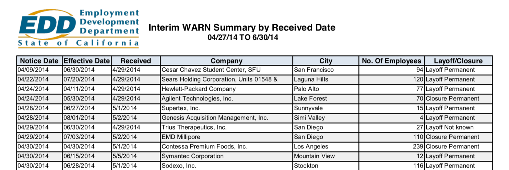

# California WARN data

The California WARN site publishes the mass layoff notices that the state **Worker Adjustment and Retraining Notification Act** requires companies to disclose:

https://www.edd.ca.gov/jobs_and_training/layoff_services_warn.htm

Unfortunately, the data is published as Excel-to-PDF format:

[data/pdfs/WARN_Interim_041614_to_063014.pdf](data/pdfs/WARN_Interim_041614_to_063014.pdf)

<a href="data/pdfs/WARN_Interim_041614_to_063014.pdf">
    
</a>


The main work of this repo's scripts is to create an automated process to turn the PDFs into structured plaintext, e.g. comma-separated values.


## Executable scripts

Here are the quickie data processing scripts this repo includes, so far:


- [src/fetch.sh](src/fetch.sh) -- basically runs wget to scrape all URLs with `.pdf` extensions from the [WARN Act landing page](https://www.edd.ca.gov/jobs_and_training/layoff_services_warn.htm). 

    These are all saved in [data/pdfs](data/pdfs)

- [src/tabulate.sh](src/tabulate.sh) -- downloads and uses [tabula-java](https://github.com/tabulapdf/tabula-java) to attempt to extract data in CSV format from the PDFs. 

    The output is in [data/tabulate](data/tabulate)

- [src/extract-rawtext.sh](src/extract-rawtext.sh) -- requires you to have already installed the [Poppler tools](https://poppler.freedesktop.org/), specifically. `pdfttotext` is used to extract raw, unstructured text from the PDFs.

    The output is in [data/rawtext](data/rawtext)    


## Todos

#### Makefile

Create a quick and easy Makefile so that people don't have to run scripts manually, e.g.

```sh
$ src/fetch.sh
$ src/extract-rawtext.sh
```

#### src/parse_rawtext.py

I haven't tried out all the options, but it doesn't seem tabula-java produces clean output, which you can see in [data/tabulate](data/tabulate)

Worst case scenario is that we'll have to use the plaintext versions in [src/rawtext](src/rawtext), which looks like this: 

```
06/24/2014   08/25/2014   6/25/2014   Sodexo, Inc.                                  Stockton           73 Layoff Permanent
06/24/2014   08/31/2014   6/26/2014   Sears Holdings Corporation/Product Rebuild    Oakland            75 Closure Permanent
06/25/2014   06/23/2014   6/30/2014   Center
                                      Children's Hospital of Orange County          Orange             61 Layoff Permanent
```


Using Python and regexes, we can implement some naive parsing logic to create proper CSV.


