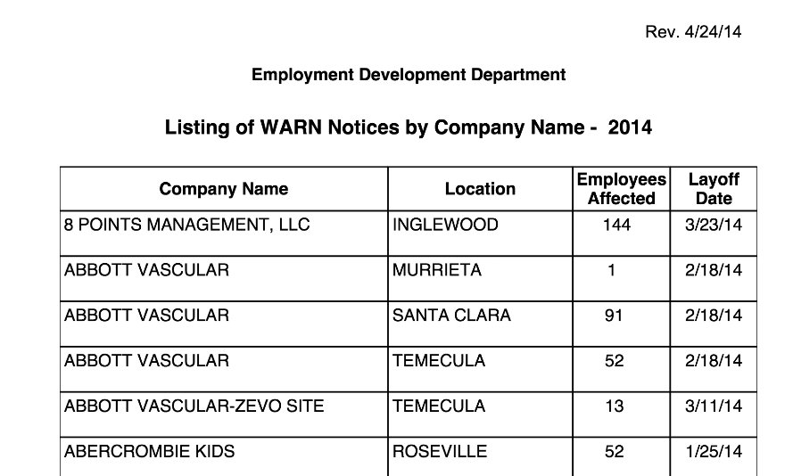
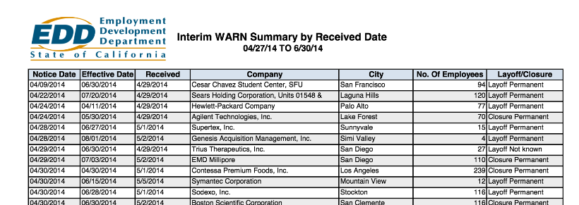
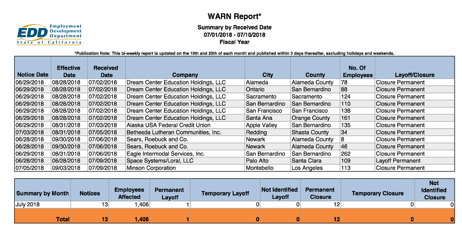

# Turning California WARN layoff PDF data into structured CSV


The California WARN site publishes the mass layoff notices that the state **Worker Adjustment and Retraining Notification Act** requires companies to disclose:

https://www.edd.ca.gov/jobs_and_training/layoff_services_warn.htm

Unfortunately, the data is published as Excel-to-PDF format:

[data/pdfs/WARN_Interim_041614_to_063014.pdf](data/pdfs/WARN_Interim_041614_to_063014.pdf)

<a href="data/pdfs/WARN_Interim_041614_to_063014.pdf">
    
</a>


The main work of this repo's scripts is to create an automated process to turn the PDFs into structured plaintext, e.g. comma-separated values.


## Executable scripts

Here are the quickie data processing scripts this repo includes, so far:


- [src/fetch.sh](src/fetch.sh) -- basically runs wget to scrape all URLs with `.pdf` extensions from the [WARN Act landing page](https://www.edd.ca.gov/jobs_and_training/layoff_services_warn.htm). 

    These are all saved in [data/pdfs](data/pdfs)

- [src/tabulate.sh](src/tabulate.sh) -- downloads and uses [tabula-java](https://github.com/tabulapdf/tabula-java) to attempt to extract data in CSV format from the PDFs. 

    The output is in [data/tabulate](data/tabulate)

- [src/extract-rawtext.sh](src/extract-rawtext.sh) -- requires you to have already installed the [Poppler tools](https://poppler.freedesktop.org/), specifically. `pdfttotext` is used to extract raw, unstructured text from the PDFs.

    The output is in [data/rawtext](data/rawtext)    

## ABBYY conversions

This project attempts to develop a completely automated script-based pipeline for data wrangling. But for a real world project with any kind of deadline, it's almost always going to be better to use a commercial product like ABBYY FineReader (and have your boss expense the $99 for it). There are cloud services, like [CometDocs](https://www.cometdocs.com/). I've had the most consistent results with ABBYY though I've never had to use it in production (didn't know about it while working at [ProPublica](https://www.propublica.org/nerds/turning-pdfs-to-text-doc-dollars-guide)).

For reference, I've included the results of manually (i.e. point-and-click)  invoking the FineReader's PDF-to-Excel conversion in the directory [data/abbbyxls](data/abbbyxls). There's still a bit of wrangling to do because the non-data fields are included, but I'll write (**TK TODO**) a Python ([with xlrd](https://github.com/python-excel/xlrd)) script to automate that tidying process.


## Todos

#### Makefile

Create a quick and easy Makefile so that people don't have to run scripts manually, e.g.

```sh
$ src/fetch.sh
$ src/extract-rawtext.sh
```

#### src/parse_rawtext.py

I haven't tried out all the options, but it doesn't seem tabula-java produces clean output, which you can see in [data/tabulate](data/tabulate)

Worst case scenario is that we'll have to use the plaintext versions in [src/rawtext](src/rawtext), which looks like this: 

```
06/24/2014   08/25/2014   6/25/2014   Sodexo, Inc.                                  Stockton           73 Layoff Permanent
06/24/2014   08/31/2014   6/26/2014   Sears Holdings Corporation/Product Rebuild    Oakland            75 Closure Permanent
06/25/2014   06/23/2014   6/30/2014   Center
                                      Children's Hospital of Orange County          Orange             61 Layoff Permanent
```


Using Python and regexes, we can implement some naive parsing logic to create proper CSV.


## Hard parts

Probably the most annoying part of this data wrangling process is the fact that the data format has changed over the years.

For example, the earliest 2014 format has only 4 fields:

<a href="data/pdfs/eddwarncn14.pdf">

</a>

Later in 2014, the data fields expanded to 7:


<a href="data/pdfs/WARN_Interim_041614_to_063014.pdf">
    
</a>

The [latest version of the data document](data/pdfs/WARN-Report-for-7-1-2018-to-07-10-2018.pdf) has 8 fields, with the addition of "County":


<a href="data/pdfs/WARN-Report-for-7-1-2018-to-07-10-2018.pdf">
    
</a>

This essentially means several variations of the plaintext-to-CSV script have to be written to deal with the different available data and spacing patterns.


